<!-- filename: 01_foundational-concepts-overview.md -->
# Foundational Concepts of Generative AI and LLMs - Overview

## 🎯 Learning Journey Overview

These four concepts form the **bedrock of understanding** for Generative AI and Large Language Models (LLMs). To maintain optimal learning focus, this content is organized into three digestible parts (100-150 lines each).

**Complete Learning Flow**: Text Processing → Tokenization → Encoding → Embeddings → Semantic Understanding

## 📚 Three-Part Learning Path

### 🧩 [02: Text Processing Fundamentals](./02_tokens-tokenization.md)

**Focus**: Foundation concepts (100-150 lines)

**What You'll Learn:**

- **Tokens**: The building blocks of AI text processing
- **Tokenization**: Breaking text into processable chunks  
- **LEGO brick and cake slicing analogies** for intuitive understanding

**Key Concepts**: Word-level, character-level, and subword tokenization strategies

---

### 🔢 [03: Numerical Representations](./03_encoding-embeddings.md)

**Focus**: Advanced transformation concepts (100-150 lines)

**What You'll Learn:**

- **Encoding**: Converting tokens into numbers machines can process
- **Embeddings**: Capturing semantic meaning in vector space
- **Zip code and multi-dimensional map analogies** for clear comprehension

**Key Concepts**: Vocabulary mapping, vector mathematics, semantic relationships

---

### 🌍 [04: Integration & Applications](./04_integration-applications.md)

**Focus**: Complete pipeline and real-world impact (100-150 lines)

**What You'll Learn:**

- **Complete Processing Flow**: How all four concepts work together
- **Real-World Applications**: Search engines, recommendations, RAG systems
- **Advanced Connections**: Links to attention mechanisms and modern AI

**Key Concepts**: End-to-end processing, practical implementation, next steps

## 🔄 The Complete Processing Pipeline

Here's the visual flow that you'll understand completely after all three parts:

```mermaid
flowchart LR
    A["📝 Raw Text <br/> 'AI is powerful!'"]
    B["🔹 Tokenization <br/> ['AI', ' is', ' powerful', '!']"]
    C["🔢 Encoding <br/> [1234, 56, 789, 999]"]
    D["📊 Embeddings <br/> [0.12, -0.98, 0.45, …]"]
    E["🔍 Similarity Search / RAG <br/> Find closest vectors"]
    F["📄 Retrieved Text <br/> 'AI is transformative!'"]

    %% Forward flow
    A --> B --> C --> D --> E --> F

    %% Reverse explanation
    F -.-> A
```

## 🎓 Why This Three-Part Structure?

**Focus Mode Benefits:**

- **Digestible Learning**: 100-150 lines per part prevents cognitive overload
- **Progressive Building**: Each part builds naturally on the previous
- **Active Practice**: Self-assessments and challenges in each section
- **Complete Coverage**: All essential concepts covered systematically

## 🚀 Start Your Learning Journey

**Recommended Path:**

1. **Begin with [02: Tokens & Tokenization](./02_tokens-tokenization.md)** - Master tokens and tokenization
2. **Continue to [03: Encoding & Embeddings](./03_encoding-embeddings.md)** - Understand encoding and embeddings  
3. **Complete with [04: Integration & Applications](./04_integration-applications.md)** - See real-world applications

**Time Investment**: ~45-60 minutes total (15-20 minutes per part)

**Learning Outcome**: Complete understanding of how AI systems process and understand text

---

## 🛡️ Quality Assurance

**Content Originality**: All three parts follow our zero-copy policy with completely original explanations and unique educational analogies.

**Focus Mode Compliance**: Each part maintains optimal 100-150 line length for maximum learning effectiveness.

**Progressive Complexity**: Concepts build systematically from simple building blocks to complex real-world applications.

---

*Start now: [02: Text Processing Fundamentals](./02_tokens-tokenization.md)*
*Part of the [90-Day Generative AI Learning Path](../learning-path-90-days.md)*
