# Foundational Concepts of Generative AI - Part 1: Text Processing Fundamentals

## 🎯 Learning Objectives

By the end of this part, you'll understand:

- What tokens are and why they're essential
- How tokenization breaks text into processable chunks
- Different tokenization strategies and their trade-offs
- The foundation for how AI systems begin to understand text

## 🔄 The Complete Processing Pipeline

Here's the visual flow of how AI systems transform human language into understanding:

```mermaid
flowchart LR
    A["📝 Raw Text <br/> 'AI is powerful!'"]
    B["🔹 Tokenization <br/> ['AI', ' is', ' powerful', '!']"]
    C["🔢 Encoding <br/> [1234, 56, 789, 999]"]
    D["📊 Embeddings <br/> [0.12, -0.98, 0.45, …]"]
    E["🔍 Similarity Search / RAG <br/> Find closest vectors"]
    F["📄 Retrieved Text <br/> 'AI is transformative!'"]

    %% Forward flow
    A --> B --> C --> D --> E --> F

    %% Reverse explanation
    F -.-> A
```



**Focus for Part 1**: We'll explore the first two steps - Raw Text → Tokenization

---

## 🧩 1. Tokens: The Building Blocks of AI Text Processing

### What Are Tokens?

**Tokens are the smallest meaningful chunks of text that an LLM processes.** They're not always complete words—they can be parts of words, whole words, punctuation, or even spaces.

### Examples in Action

```text
Input: "Hello, Swamy!"

Tokenization Result:
- "Hello" → 1 token (complete word)
- "," → 1 token (punctuation)
- " " → 1 token (space)
- "Swamy" → 1 token (proper noun)
- "!" → 1 token (punctuation)

Total: 5 tokens
```

```text
Input: "AI preprocessing fantastic"

Tokenization Result:
- "AI" → 1 token (acronym)
- " pre" → 1 token (word beginning with space)
- "processing" → 1 token (complete word)
- " fan" → 1 token (partial word with space)
- "tastic" → 1 token (word ending)

Total: 5 tokens
```

### 🏗️ Building Block Analogy

**Tokens are like LEGO bricks:**

- You don't build a house with the entire wall (sentence)
- You build with individual bricks (tokens)
- Each brick has a specific shape and purpose
- Different combinations create different structures (meanings)

### Why Tokens Matter

1. **Computational Efficiency**: Smaller processing units than full words
2. **Flexibility**: Handle unknown words by breaking them into known parts
3. **Multilingual Support**: Work across different languages and scripts
4. **Cost Control**: Many AI APIs charge by token count

---

## 🔹 2. Tokenization: The Art of Text Segmentation

### What Is Tokenization?

**Tokenization is the systematic process of breaking raw text into tokens.** It's the first step in preparing text for AI processing, like preparing ingredients before cooking.

### The Tokenization Process

```text
Step 1: Raw Input
"The AI model preprocesses tokenization patterns efficiently"

Step 2: Tokenization Algorithm (BPE - Byte Pair Encoding)
["The", " AI", " model", " pre", "processes", " token", "ization", " patterns", " efficiently"]

Step 3: Ready for Processing
9 tokens ready for encoding
```

### Different Tokenization Strategies

#### Word-Level Tokenization

```text
Input: "machine learning rocks"
Output: ["machine", "learning", "rocks"]
Pros: Human-readable, intuitive
Cons: Huge vocabulary, can't handle new words
```

#### Character-Level Tokenization

```text
Input: "AI"
Output: ["A", "I"]
Pros: Small vocabulary, handles any text
Cons: Long sequences, loses word meaning
```

#### Subword Tokenization (BPE - Modern Standard)

```text
Input: "unhappiness"
Output: ["un", "happiness"] or ["unhapp", "iness"]
Pros: Balanced vocabulary size, handles new words
Cons: Requires training, less intuitive
```

### 🍰 Cake Slicing Analogy

**Tokenization is like slicing a cake:**

- Raw text = whole cake
- Tokens = individual slices
- You slice to make it manageable to serve (process)
- Different slicing strategies create different portion sizes
- Each slice must be meaningful and consumable

### Why Tokenization Is Critical

1. **Standardization**: Creates uniform processing units
2. **Efficiency**: Optimizes model vocabulary size
3. **Handling Unknowns**: Breaks new words into known components
4. **Language Agnostic**: Works across different languages

---

## 🎓 Part 1 Self-Assessment

### Quick Understanding Check

1. **Token Identification**: How many tokens would "AI's preprocessing" likely contain?
2. **Strategy Comparison**: When would you prefer character-level over subword tokenization?
3. **Real-World Impact**: Why do AI APIs charge by token count rather than word count?

### Hands-On Challenge

Try to manually tokenize this text using subword logic:

```text
"Preprocessing enables efficient tokenization"
```

**Hint**: Look for common prefixes, suffixes, and root words.

---

## 🔄 Coming Up in File 03

In the next part, we'll explore:

- **Encoding**: How tokens become numbers that machines can process
- **Embeddings**: How numbers capture semantic meaning and relationships
- **Vector Mathematics**: The math that powers AI understanding

**Key Connection**: The tokens you've learned about here become the foundation for everything that follows!

---

## 🛡️ Learning Notes

**Focus Achievement**: This part covered the essential foundation - how text becomes processable units.
**Next Challenge**: Understanding how these units become meaningful to AI systems.
**Progressive Building**: Each concept builds naturally into the next.

---

*Continue to: [03: Encoding & Embeddings](./03_encoding-embeddings.md)*
*Part of the [90-Day Generative AI Learning Path](../learning-path-90-days.md)*
