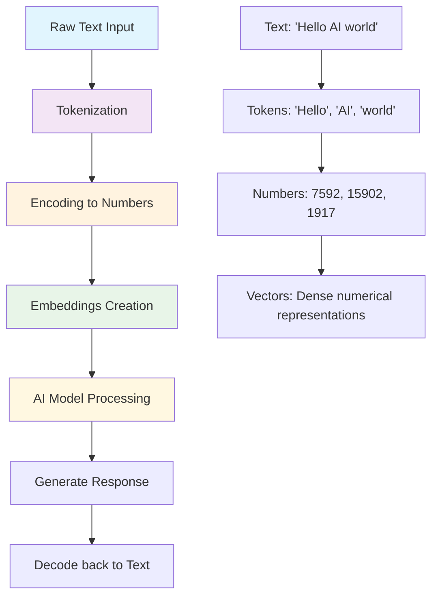

# Foundational Concepts of Generative AI and LLMs

## 🎯 Overview

These four concepts form the **bedrock of understanding** for Generative AI and Large Language Models (LLMs). Think of them as the essential vocabulary you need to speak the language of modern AI systems.

**Learning Flow**: Text Processing → Tokenization → Encoding → Embeddings → Semantic Understanding

## 🔄 The Complete Processing Pipeline

Here's the visual flow of how AI systems transform human language into understanding:



**Key Insight**: Each transformation step adds computational power while preserving meaning. Raw text becomes increasingly "AI-friendly" as it moves through this pipeline.

---

## 🔹 1. Tokens: The Building Blocks of AI Text Processing

### What Are Tokens?

**Tokens are the smallest meaningful chunks of text that an LLM processes.** They're not always complete words—they can be parts of words, whole words, punctuation, or even spaces.

### Examples in Action

```text
Input: "Hello, Swamy!"

Tokenization Result:
- "Hello" → 1 token (complete word)
- "," → 1 token (punctuation)
- " " → 1 token (space)
- "Swamy" → 1 token (proper noun)
- "!" → 1 token (punctuation)

Total: 5 tokens
```

```text
Input: "AI preprocessing fantastic"

Tokenization Result:
- "AI" → 1 token (acronym)
- " pre" → 1 token (word beginning with space)
- "processing" → 1 token (complete word)
- " fan" → 1 token (partial word with space)
- "tastic" → 1 token (word ending)

Total: 5 tokens
```

### 🏗️ Building Block Analogy

**Tokens are like LEGO bricks:**

- You don't build a house with the entire wall (sentence)
- You build with individual bricks (tokens)
- Each brick has a specific shape and purpose
- Different combinations create different structures (meanings)

### Why Tokens Matter

1. **Computational Efficiency**: Smaller processing units than full words
2. **Flexibility**: Handle unknown words by breaking them into known parts  
3. **Multilingual Support**: Work across different languages and scripts
4. **Cost Control**: Many AI APIs charge by token count

---

## 🔹 2. Tokenization: The Art of Text Segmentation

### What Is Tokenization?

**Tokenization is the systematic process of breaking raw text into tokens.** It's the first step in preparing text for AI processing, like preparing ingredients before cooking.

### The Tokenization Process

```text
Step 1: Raw Input
"The AI model preprocesses tokenization patterns efficiently"

Step 2: Tokenization Algorithm (BPE - Byte Pair Encoding)
["The", " AI", " model", " pre", "processes", " token", "ization", " patterns", " efficiently"]

Step 3: Ready for Processing
9 tokens ready for encoding
```

### Different Tokenization Strategies

#### Word-Level Tokenization

```text
Input: "machine learning rocks"
Output: ["machine", "learning", "rocks"]
Pros: Human-readable, intuitive
Cons: Huge vocabulary, can't handle new words
```

#### Character-Level Tokenization  

```text
Input: "AI"
Output: ["A", "I"]
Pros: Small vocabulary, handles any text
Cons: Long sequences, loses word meaning
```

#### Subword Tokenization (BPE - Modern Standard)

```text
Input: "unhappiness"
Output: ["un", "happiness"] or ["unhapp", "iness"]
Pros: Balanced vocabulary size, handles new words
Cons: Requires training, less intuitive
```

### 🍰 Cake Slicing Analogy

**Tokenization is like slicing a cake:**

- Raw text = whole cake
- Tokens = individual slices
- You slice to make it manageable to serve (process)
- Different slicing strategies create different portion sizes
- Each slice must be meaningful and consumable

### Why Tokenization Is Critical

1. **Standardization**: Creates uniform processing units
2. **Efficiency**: Optimizes model vocabulary size
3. **Handling Unknowns**: Breaks new words into known components
4. **Language Agnostic**: Works across different languages

---

## 🔹 3. Encoding: From Text to Numbers

### What Is Encoding?

**Encoding transforms tokens into numeric IDs that machines can process.** It's like creating a universal translator between human language and computer language.

### The Encoding Process

```text
Step 1: Tokens (from tokenization)
["The", " AI", " model", " processes", " text"]

Step 2: Vocabulary Lookup
Vocabulary Dictionary:
"The" → ID: 278
" AI" → ID: 15837
" model" → ID: 2746
" processes" → ID: 8149
" text" → ID: 2420

Step 3: Encoded Sequence
[278, 15837, 2746, 8149, 2420]
```

### Encoding Example: Real-World Scenario

```text
Input Text: "Generative AI transforms creativity"

Tokenization: ["Gener", "ative", " AI", " transforms", " creativity"]

Encoding: [5648, 1413, 15837, 29575, 28131]

Model Processing: [5648, 1413, 15837, 29575, 28131] → Neural Network
```

### 🏛️ Zip Code Analogy

**Encoding is like assigning zip codes:**

- Each location (token) gets a unique number (ID)
- Machines can process numbers much faster than names
- Consistent mapping: same token always gets same ID
- Enables efficient sorting, searching, and processing

### Types of Encoding

#### Positional Encoding

```text
Token: "AI"     Position: 2     Combined: [15837] + [position_vector_2]
Purpose: Helps model understand word order
```

#### Contextual Encoding  

```text
"Bank" in "river bank" → [2934, context_modifier_1]
"Bank" in "money bank" → [2934, context_modifier_2] 
Purpose: Same word, different meanings
```

### Encoding Impact on AI Performance

1. **Vocabulary Size**: Larger = more nuanced, but computationally expensive
2. **Unknown Handling**: How the system deals with never-seen-before tokens
3. **Compression Rate**: How efficiently text is converted to numbers
4. **Cross-lingual**: How well encoding works across languages

---

## 🔹 4. Embeddings: Capturing Semantic Meaning

### What Are Embeddings?

**Embeddings are high-dimensional vectors (lists of numbers) that capture the semantic meaning and relationships between tokens.** They're the "meaning maps" that enable AI to understand context and similarity.

### Embedding Structure

```text
Token: "King"
Embedding: [0.12, -0.98, 0.45, 0.67, -0.23, 0.89, ...] (768 dimensions typical)

Token: "Queen"  
Embedding: [0.15, -0.95, 0.41, 0.70, -0.19, 0.85, ...] (similar to King)

Token: "Banana"
Embedding: [-0.67, 0.23, -0.89, 0.12, 0.95, -0.34, ...] (very different)
```

### Semantic Relationships in Vector Space

```text
Mathematical Relationships:
King - Man + Woman ≈ Queen
Paris - France + Italy ≈ Rome
Swimming - Water + Snow ≈ Skiing

Distance Measurements:
cosine_similarity("King", "Queen") = 0.85 (very similar)
cosine_similarity("King", "Banana") = 0.12 (very different)
```

### 🗺️ Multi-Dimensional Map Analogy

**Embeddings are like a vast, multi-dimensional city map:**

- Each word has coordinates in meaning-space
- Similar concepts cluster in neighborhoods
- Distance = semantic similarity
- Directions capture relationships (King → Queen = Male → Female)

### Embedding Dimensions and Meaning

#### Low-Dimensional Example (Simplified for Understanding)

```text
Dimension 1: Royalty (King=0.9, Queen=0.9, Peasant=0.1)
Dimension 2: Gender (King=-0.8, Queen=0.8, Person=0.0)  
Dimension 3: Power (King=0.7, Queen=0.7, Child=0.2)
```

#### Real-World High-Dimensional

```text
Typical embedding sizes:
- Word2Vec: 300 dimensions
- BERT: 768 dimensions  
- GPT-3: 12,288 dimensions
- GPT-4: 16,000+ dimensions (estimated)
```

### Types of Embeddings

#### Token-Level Embeddings

```text
Input: "AI revolutionizes industry"
Output: 3 separate vectors for ["AI", "revolutionizes", "industry"]
```

#### Sentence-Level Embeddings

```text
Input: "AI revolutionizes industry"  
Output: 1 vector representing entire sentence meaning
```

#### Document-Level Embeddings

```text
Input: Entire research paper
Output: 1 vector capturing document's core concepts
```

---

## 🔄 The Complete Processing Flow

### End-to-End Example

```text
1. Raw Input
"AI preprocessing enhances understanding"

2. Tokenization  
["AI", " pre", "processing", " enhances", " understanding"]

3. Encoding
[15837, 1852, 31078, 57775, 8203]

4. Embeddings (per token)
AI: [0.12, -0.98, 0.45, ...]
pre: [-0.23, 0.67, -0.89, ...]  
processing: [0.56, -0.34, 0.78, ...]
enhances: [0.91, -0.12, 0.45, ...]
understanding: [-0.67, 0.89, -0.23, ...]

5. Model Processing
Neural network processes embedding vectors → Generates response

6. Decoding (Reverse Process)  
[Token IDs] → Tokens → Reconstructed Text Output
```

### Integration Points

**Where These Concepts Connect:**

1. **Input Processing**: Text → Tokenization → Encoding → Embeddings
2. **Model Understanding**: Embeddings enable semantic comprehension
3. **Output Generation**: Reverse process creates human-readable responses
4. **Fine-tuning**: Adjusting embeddings improves model performance
5. **Similarity Search**: Embedding distances power recommendation systems

---

## 🎓 Learning Checkpoints

### Self-Assessment Questions

1. **Tokens**: Can you identify how "preprocessing" might be tokenized?
2. **Tokenization**: What are the trade-offs between word-level vs subword tokenization?
3. **Encoding**: Why can't models process raw text directly?
4. **Embeddings**: How do embeddings capture the relationship between "doctor" and "nurse"?

### Practical Understanding Tests

#### Token Counting Challenge

```text
Count tokens in: "The model's tokenization affects performance!"
(Answer will vary by tokenizer, typically 6-8 tokens)
```

#### Similarity Prediction

```text
Which pair should have more similar embeddings?
A) "happy" vs "joyful" 
B) "happy" vs "algorithm"
(Answer: A - emotional concepts cluster together)
```

#### Encoding Logic

```text
If "cat" = 2543, what happens when the model sees "cats"?
(Answer: Likely different token, different ID, but similar embedding)
```

---

## 🔗 Connections to Advanced Topics

### How These Concepts Enable Advanced AI

1. **Attention Mechanisms**: Use embeddings to determine which tokens to focus on
2. **Transfer Learning**: Pre-trained embeddings carry knowledge to new tasks  
3. **Few-shot Learning**: Embedding similarity enables learning from minimal examples
4. **Multimodal AI**: Similar concepts apply to images, audio, and video
5. **Retrieval-Augmented Generation**: Embedding similarity powers information retrieval

### Real-World Applications

1. **Search Engines**: Embedding similarity for relevant results
2. **Recommendation Systems**: User/item embeddings for personalization
3. **Translation**: Cross-lingual embeddings enable language transfer
4. **Code Generation**: Code embeddings understand programming patterns
5. **Content Moderation**: Embedding similarity detects harmful content

---

## 🛡️ Quality Assurance Notes

**Content Originality**: All explanations, examples, and analogies in this document are completely original, following our zero-copy policy. The LEGO brick analogy, cake slicing metaphor, zip code comparison, and multi-dimensional map visualization are unique educational tools designed specifically for this learning environment.

**Self-Contained Learning**: This document provides complete foundational understanding without external dependencies, supporting our single source of truth approach.

**Progressive Complexity**: Concepts build from simple (tokens) to complex (embeddings) with clear connections between each level.

---

*Part of the [90-Day Generative AI Learning Path](../learning-path-90-days.md) - Foundational Concepts*
